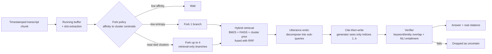
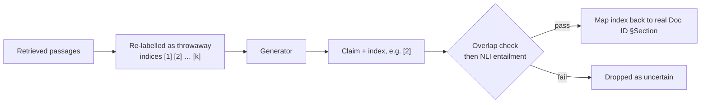
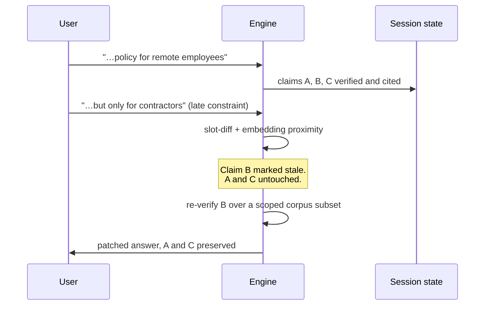

<div align="center">

# ⚡ Streaming Live RAG

### Retrieval that starts **before you finish your sentence.**

An event-driven RAG engine for live voice and chat. It forks retrieval mid-utterance, splits compound requests into parallel sub-queries, **patches individual claims** when a late constraint arrives, and makes citation fabrication **structurally impossible**.


-orange)


**p50 answer latency after the user stops speaking: 29 ms** (batch baseline: 445 ms)

[Start here](#-start-here) · [Quickstart](#-quickstart) · [Results](#-results) · [How it works](#-how-it-works) · [Guarantees](#-guarantees) · [Commands](#-commands) · [Layout](#-repository-layout)

<br>

### [▶️ Watch the demo video](docs/demo_video.mp4) &nbsp;·&nbsp; [📐 Architecture spec](docs/Theme4_RAG_ArchitectureSpec.md) &nbsp;·&nbsp; [📊 Benchmark report](docs/benchmark_report.md)

</div>

---

## 🏁 Start here

> [!IMPORTANT]
> **Reviewing this submission?** Everything you need is in the [`docs/`](docs) folder. Here is the fastest path through it.

| # | What you want | Open this | Time |
|---|---|---|---|
| 1 | **See it working** | [▶️ `docs/demo_video.mp4`](docs/demo_video.mp4) | ~ demo |
| 2 | **Understand the design** | [📐 `docs/Theme4_RAG_ArchitectureSpec.md`](docs/Theme4_RAG_ArchitectureSpec.md) | full spec |
| 3 | **Quick architecture overview** | [🧭 `docs/architecture_brief.md`](docs/architecture_brief.md) | short read |
| 4 | **Check the numbers** | [📊 `docs/benchmark_results.md`](docs/benchmark_results.md) (test split) | tables |
| 5 | **Read the honest analysis** | [🔍 `docs/benchmark_report.md`](docs/benchmark_report.md) | incl. failures |
| 6 | **Inspect the trace format** | [🧾 `docs/telemetry_schema.md`](docs/telemetry_schema.md) | schema |
| 7 | **Run it yourself** | `python run_demo.py` ([Quickstart](#-quickstart)) | one command |

Raw benchmark data: [`benchmark_results.json`](docs/benchmark_results.json) (test) · [`benchmark_results_dev.json`](docs/benchmark_results_dev.json) · [`benchmark_results_dev.md`](docs/benchmark_results_dev.md) (dev split)

---

## 🎯 The problem

Classic RAG waits for the full query, then retrieves, then generates. In live voice and chat that dead time is the whole user experience. Worse, when a user says *"…actually, make that for contractors"* halfway through, a batch pipeline throws everything away and starts over.

## 💡 The idea

Treat speech as a **stream of events**, not a single string.

| | Naive batch RAG | **Streaming Live RAG** |
|---|---|---|
| When retrieval starts | After the utterance ends | **While the user is still talking** |
| Compound request ("X and also Y") | One blended query | **Parallel sub-queries per intent** |
| Late constraint or correction | Full restart | **Patch only the stale claims** |
| Citations | Model may emit any ID | **Model can only emit throwaway indices** |
| Observability | Logs, if you're lucky | **Every decision traced as structured JSON** |

---

## 🚀 Quickstart

```bash
pip install -r requirements.txt      # Python 3.11+
python run_demo.py                   # one command, unattended
```

That single command will:

1. Build and cache the index
2. Replay the guide's three worked examples, plus a **topic-shift** and a **slot-change** scenario
3. Print each answer with its citations and latency
4. Write the trace, outputs and an **HTML branch-timeline dashboard** to `runs/<timestamp>/`

> No API key. No network after the first model download (~420 MB, cached locally).

Want to watch it happen live? Use `python run_demo.py --realtime` to deliver chunks at their real timestamps, which works well for demo videos.

---

## 📊 Results

Held-out **test split: 30 conversations / 39 turns.**

| Gate | Target | Streaming engine | Batch baseline |
|---|---|---|---|
| **G1** Reproducibility | one command, unattended | `python run_demo.py --all` · 33 tests pass | n/a |
| **G2** Early retrieval | ≥ 80 % | **90.6 %** (0 % false triggers on no-retrieval turns) | 0 % (100 % false triggers) |
| **G3** Multi-intent split | ≥ 70 % | **100 %** (87.5 % exact intent count) | 0 % |
| **G4** Citation support | ≥ 85 %, 0 fabricated IDs | **95.3 %** gold-document precision, **0** fabricated, 0 untraceable | 76.5 %, 0 fabricated |
| **G5** Session refinement | refine, don't restart | **75 %** state preserved · **100 %** of refinements searched a scoped subset | 0 % · 0 % |
| **G6** Telemetry | 100 % trace coverage | **100 %** | 100 % |

### Latency after utterance end

| | p50 | p95 |
|---|---|---|
| **Streaming engine** | **29 ms** | **197 ms** |
| Batch baseline | 445 ms | 536 ms |

Full tables with all three ablations: [`docs/benchmark_results.md`](docs/benchmark_results.md)
Analysis, including edge-case failures: [`docs/benchmark_report.md`](docs/benchmark_report.md)

> We publish the misses too. G5's 75 % state-preservation and G3's 87.5 % exact intent count are not hidden; they are analysed in the benchmark report.

---

## 🧠 How it works

### Three shared primitives, reused everywhere

| Primitive | Model / structure | Used by |
|---|---|---|
| **One encoder** | `all-MiniLM-L6-v2` | fork policy, decomposition, retrieval, claim staleness |
| **One cluster index** | k-means over corpus chunks | fork policy, decomposition, retrieval prior |
| **One NLI verifier** | `nli-MiniLM2-L6-H768` | grounding, claim re-verification |

No model-per-stage sprawl: **2 small models (~110 M parameters total), 0 services.**

### End-to-end flow



### 1. Fork policy: when to start retrieving

Each chunk's running buffer is compared against the cluster centroids **once**.

- **Low affinity:** wait, since the user hasn't said anything retrievable yet
- **Low entropy:** fork one retrieval branch
- **Near-tied clusters:** fork up to four cheap, retrieval-only branches and keep whichever the final utterance confirms

### 2. Decomposition: compound requests become parallel work

Clauses are mapped to clusters. Clauses that land on **distinct clusters** become parallel sub-queries, each with at most one generator call.

### 3. Cite-then-write: fabrication is impossible by construction



The generator never sees a real Doc ID, so it cannot emit one, real or invented. Every surviving claim must also be **entailed by its cited chunk**.

### 4. Claim patching: a late constraint doesn't mean a restart



Only stale claims are re-verified, and only over a **scoped subset** of the corpus, which is why refinements are cheap.

### 5. Telemetry: every decision is a JSON event

Fork, wait, suppress, patch, verify, and drop are all logged to a JSONL trace, validated for **100 % coverage** (G6), and rendered into an HTML branch-timeline dashboard. Schema: [`docs/telemetry_schema.md`](docs/telemetry_schema.md).

Architecture brief: [`docs/architecture_brief.md`](docs/architecture_brief.md)

---

## 🛡️ Guarantees

| Guarantee | Mechanism |
|---|---|
| **No fabricated citation IDs** | Generator only ever sees `[1..k]`; real IDs are attached after verification |
| **No unsupported claims** | Each claim must pass keyword/entity overlap **and** NLI entailment against its cited chunk |
| **Corpus isolation** | Default generator returns only verbatim corpus sentences; a hosted LLM sees only retrieved passages |
| **No hardcoding** | Nothing in `engine/` references corpus content or test prompts; cluster count, labels and gazetteer are all derived from the loaded corpus |
| **Session-bound state** | A `Session` lives in memory for one conversation; nothing crosses sessions; only the telemetry trace hits disk |
| **Parsimony** | 2 small models, 0 services, at most one generator call per sub-question, forked branches spend retrieval only |

---

## 🧰 Commands

| Command | What it does |
|---|---|
| `python run_demo.py` | Replay `examples/*.json` (guide Examples 1–3, plus topic shift and slot change) |
| `python run_demo.py --realtime` | Same, delivering chunks at their real timestamps (demo video mode) |
| `python run_demo.py --scenario file.json` | Replay any scenario ([format](simulator/stream_replay.py)) |
| `python run_demo.py --corpus path/to/docs` | Use another corpus (`.md`/`.txt` with `## §N` sections, or `.jsonl`) |
| `python run_demo.py --bench [--split dev]` | Benchmark vs. baseline plus ablations → `docs/benchmark_results.*` |
| `python run_demo.py --all` | Demo **and** benchmark |
| `python -m pytest -q` | 33 tests: guide Examples 1–3, zero-hallucination, patching, primitives |
| `docker compose up --build` | Container: tests, then demo and benchmark (models baked in, runs offline) |

### Bring your own corpus

```bash
python run_demo.py --corpus path/to/docs
```

Accepts `.md` / `.txt` files using `## §N` section headings, or a `.jsonl` file. Clusters, labels and the entity gazetteer are rebuilt automatically from whatever you provide.

### Optional: hosted LLM

The default `extractive` generator is deterministic, offline and zero-token. It answers the same closed-index JSON contract by selecting verbatim corpus sentences. To use a hosted model instead:

```bash
cp .env.example .env
```

```ini
LLM_BACKEND=openai
LLM_BASE_URL=...
LLM_API_KEY=...
LLM_MODEL=...
```

Any OpenAI-compatible endpoint works, including Gemini's. The same verifier still gates every claim, so a hosted model cannot bypass grounding.

---

## 🗂️ Repository layout

```
run_demo.py                 single entrypoint (G1)
corpus/
  documents/                20 synthetic policy docs, "Doc_ID §Section" (71 chunks)
  loader.py                 chunking with provenance; also accepts .txt / .jsonl
  indexer.py                BM25 + FAISS + k-means + sentence embeddings + gazetteer (built once, cached)
engine/
  primitives.py             embed() / cosine / entropy: the shared encoder primitive
  slots.py                  extract_slots(): regex + corpus gazetteer, never generative
  fork_policy.py            wait / fork / suppress / patch controller
  decomposer.py             clause-to-cluster multi-intent decomposition
  retriever.py              BM25 + FAISS + cluster prior, fused with RRF, scoped search
  grounding.py              cite-then-write, overlap + NLI verifier (micro-batched)
  claims.py                 Claim / Branch / SubQuery, claim-level patching
  presentation.py           presentation-only turns
  pipeline.py               event-driven orchestrator, branch lifecycle
  baseline.py               naive batch RAG used for comparison
  llm_client.py             async pluggable generators (extractive default, OpenAI-compatible)
  session.py                ephemeral session state + stream clock
telemetry/                  JSONL event logger, trace validator (G6), HTML dashboard
simulator/stream_replay.py  timestamped chunk replay (virtual or real time)
bench/                      benchmark conversations (dev/test) + runner/scorer
tests/                      pytest suite
docs/                       architecture brief, benchmark report + results, telemetry schema
```

---

## 🔬 Reproduce everything

```bash
pip install -r requirements.txt
python -m pytest -q          # 33 tests
python run_demo.py --all     # demo + benchmark (G1)
```

Or fully containerised and offline:

```bash
docker compose up --build
```

Thresholds are generic similarity and probability levels tuned on the **dev** split and reported on the held-out **test** split.

---

## 📚 Documentation

| Doc | Contents |
|---|---|
| [`docs/demo_video.mp4`](docs/demo_video.mp4) | Prototype demo video |
| [`docs/Theme4_RAG_ArchitectureSpec.md`](docs/Theme4_RAG_ArchitectureSpec.md) | Full Theme 4 architecture specification |
| [`docs/architecture_brief.md`](docs/architecture_brief.md) | Design of the fork policy, decomposition, grounding and patching |
| [`docs/benchmark_results.md`](docs/benchmark_results.md) | Full tables with all three ablations |
| [`docs/benchmark_report.md`](docs/benchmark_report.md) | Analysis, including edge-case failures |
| [`docs/telemetry_schema.md`](docs/telemetry_schema.md) | Structured trace event schema |

---

<div align="center">

**Built for Samsung PRISM GenAI Hackathon · 3rd Edition · Theme 4**

*Start early. Cite honestly. Patch, don't restart.*

</div>
